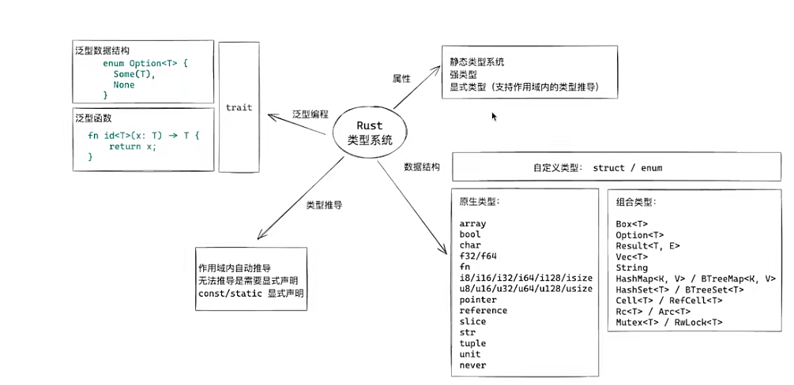
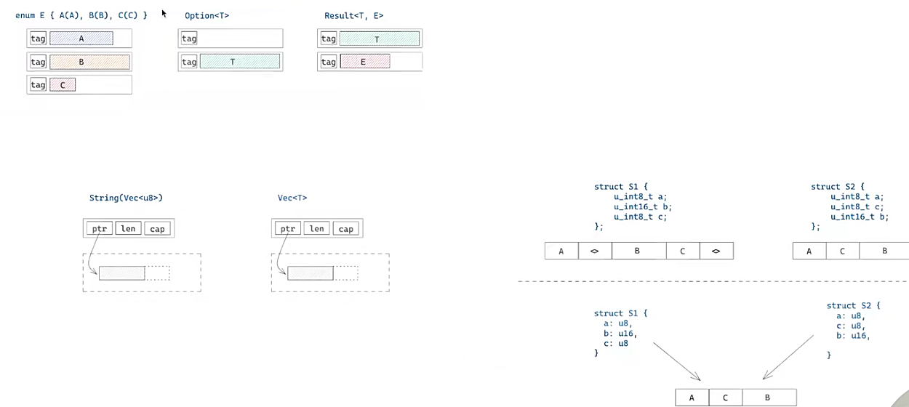
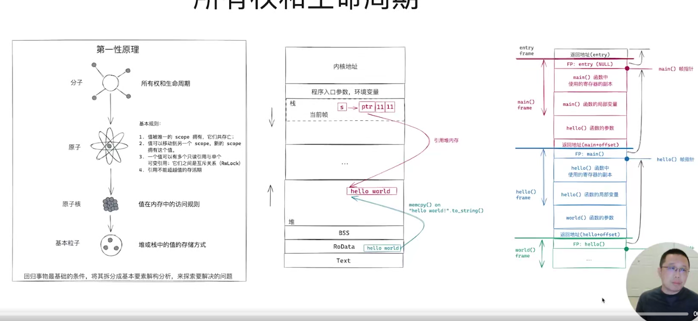
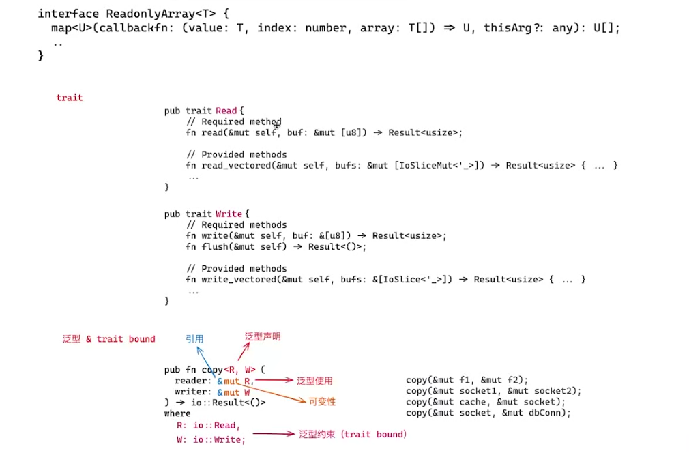
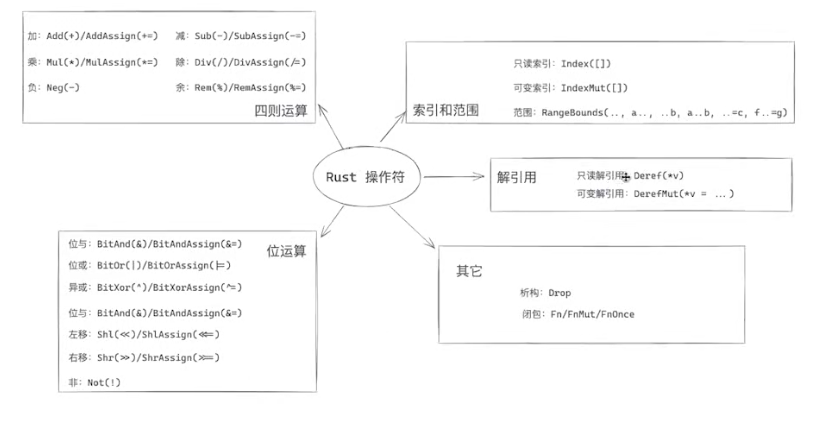

# Rust 的类型系统 & 所有权和生命周期 & 范型和 Trait

## 类型系统

看图：

Unit 类型：只有一个值，即 ()。

Box<T> 将一个值放入堆中，返回一个指向这个值的指针。

Option<T> 常用,代表了一个数据有值或为 null 的情况。如果不处理 null 的情况，编译器就会报警。（解决了其他语言 null 不检查 到线上出问题的情况）

Reuslt<T> 常用，代表了一个操作成功或失败的情况。

Vec<T> 是一个动态数组，可以增长和缩短。(向量) 可变 分配在堆上

String 是一个可变的 UTF-8 编码的字符串。分配在堆上，可变长

HashMap<K,V> / BTreeMap<K,V> 是一个哈希表，分配在堆上，可变长。Rust 上字典类型的支持 HashMap 对应 Python 中的 dict, BTreeMap 对应 Python 中的 OrderedDict。

HashSet<T> / BtreeSet<T> 是一个集合，分配在堆上，可变长。

Cell<T> / RefCell<T> 是一个可变引用，分配在堆上，可变长(跨线程使用相关)

Rc<T> / Arc<T> 是一个引用，分配在堆上，可变长（跨线程使用相关)

Mutex<T> / RwLock<T> 是一个互斥锁，分配在堆上，可变长（跨线程使用相关)

数据结构在内存中的排布

Rust 上有内存结构优化的，如果是给 C 用的，那么就需要手动声明，关闭优化。

## 所有权和生命周期（难！）

## 范型和 Trait

Trait 是一种抽象类型，它定义了方法签名，但不提供方法的实现。例如让范型 T 必须遵循某个特定的约束,拥有某个方法。

Rurst 提供的标准的操作符

